# Teams Priority Incident Response
[HOME](README.md) | Crawl | [WALK](Walk.md) | [RUN](Run.md)
## CRAWL: post a message in a Teams channel from ServiceNow using an Incoming Webhook
1. [Create an incoming webhook in Microsoft Teams](#create-an-incoming-webhook-in-microsoft-teams)
2. [Create ServiceNow Outbound REST Message to call Microsoft Power Automate](#create-servicenow-outbound-rest-message-to-call-microsoft-power-automate)
3. [Create ServiceNow workflow to post message to Microsoft Teams](#create-servicenow-workflow-to-call-rest-message)


### Pros and Cons
TODO: table?

Pros
- blah

Cons
- blah

### Create an incoming webhook in Microsoft Teams
1. In Microsoft Teams, create a team named `Service Desk` (if you don't already have a team you want to use)
2. Add a Channel named `Incidents`
3. Set up notifications on the `Incidents` channel to get notified on every message
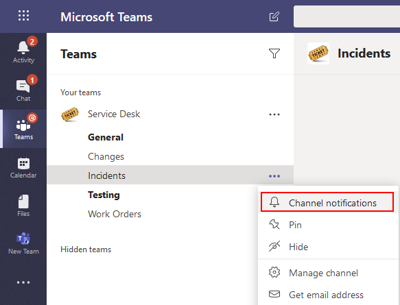
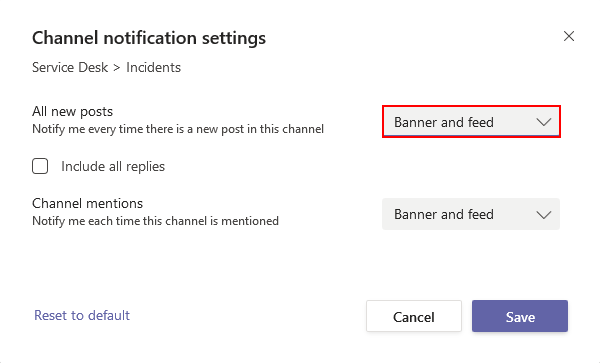
4. Enable Channel moderation on `Incidents` so only priority incident notifications from Service Now are allowed as messages at the root level. This will make it harder for people to accidentally post new messages instead of relying to existing ones (except Owners could sitll do it). 
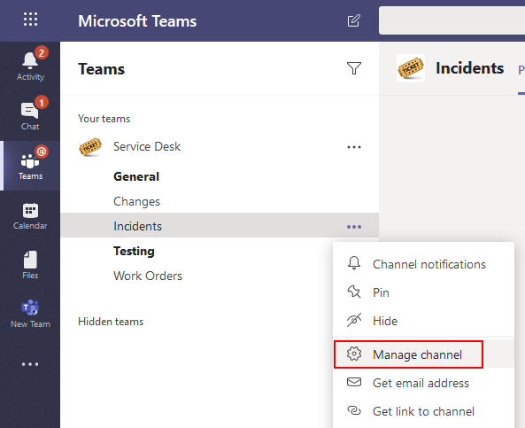
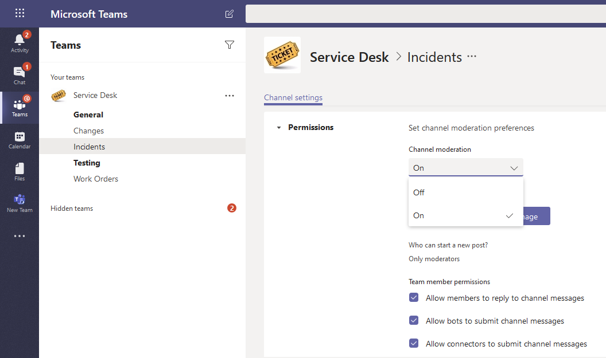
5. In Microsoft Teams, add an Incoming Webhook connector to the appropriate channel in the appropriate team.
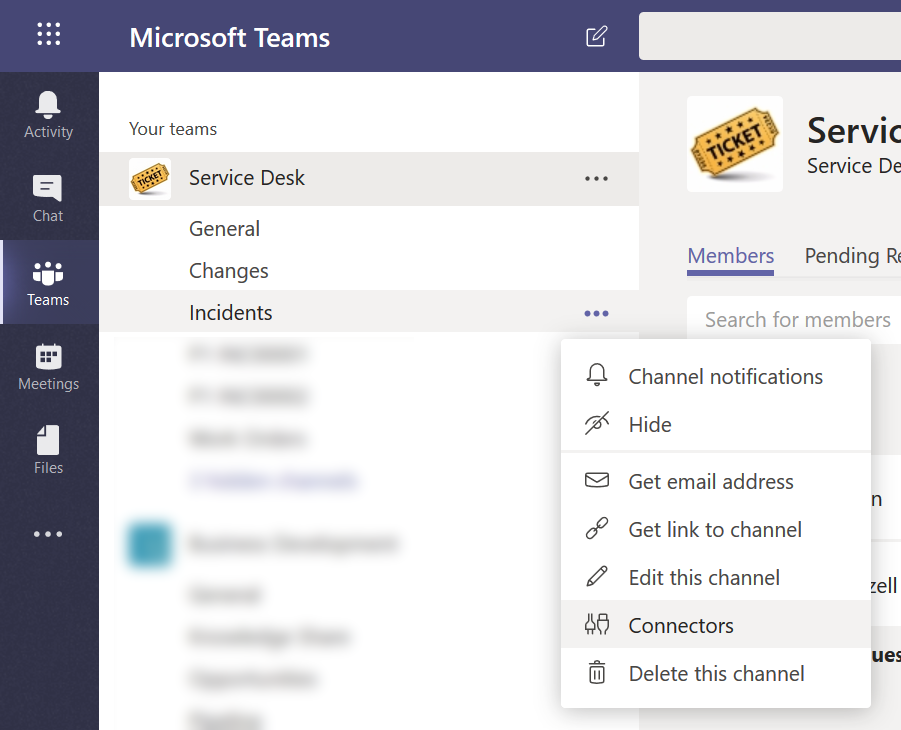
6. Click `Configure` next to `Incoming Webhook`

7. Name: `ServiceNow Incidents`
8. Upload a ServiceNow logo image: https://community.servicenow.com/794bd5f3dbcbab40fa192183ca961966.iix
9. Click `Create`
10. Copy the `URL` for the webhook and paste in OneNote/notepad for later use

### Create ServiceNow Outbound REST Message to call Microsoft Power Automate
**Notice:** I am not an expert at anything, especially ServiceNow.
1. In ServiceNow, under `System Web Services` > `Outbound`, click on `REST Message`

2. Create a new REST Message with the following properties:
    - **Name**: Teams Service Desk Incidents Webhook
    - **Accessible from**: All application scopes
    - **Description**: Call the Webhook configured in Microsoft Teams in the Incidents channel of the Service Desk team
    - **Endpoint**: [paste in the incoming webhook URL that was generated above in Basic step 1]
    - Add an HTTP Header for Content-Type: `application/json`
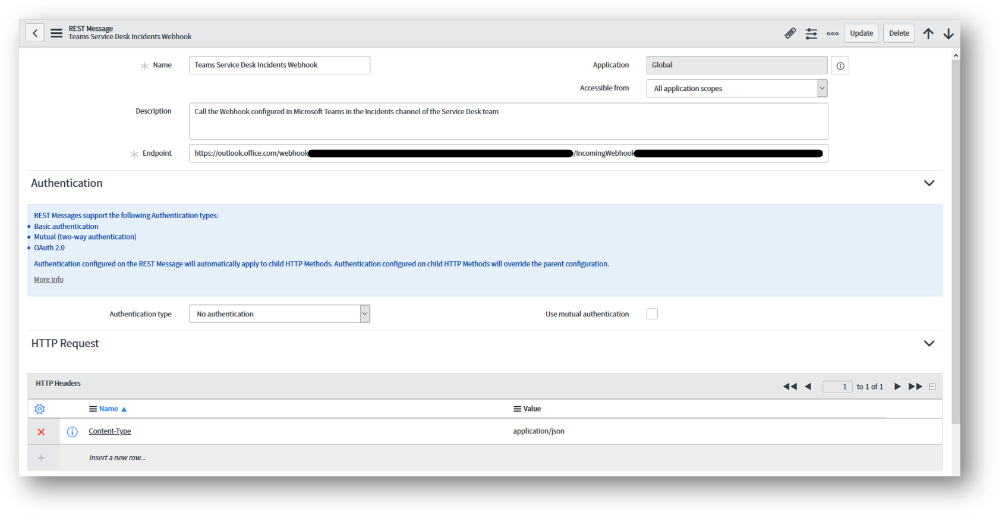
3. Add a `Default POST` HTTP Method


4. Set the `Content` field:
```
{
    "@type": "MessageCard",
    "@context": "http://schema.org/extensions",
    "themeColor": "0076D7",
    "summary": "${incident} - ${title}",
    "sections": [{
        "activityTitle": "${incident} - ${title}",
        "activitySubtitle": "${requester} created a Priority Incident in ServiceNow",
        "activityImage": "",
        "facts": [{
            "name": "Created",
            "value": "${created}"
        }, {
            "name": "Category",
            "value": "${category}"
        }, {
            "name": "Priority",
            "value": "${priority}"
        }, {
            "name": "Description",
            "value": "${description}"
        }],
        "markdown": true
    }],
    "potentialAction": [
        {
            "@context": "http://schema.org",
            "@type": "ViewAction",
            "name": "View in ServiceNow",
            "target": [
                "https://YOURINSTANCE.service-now.com/nav_to.do?uri=incident.do?sysparm_query=number=${incident}"
            ]
        },
        {
            "@context": "http://schema.org",
            "@type": "ViewAction",
            "name": "Start triage call",
            "target": [
                "https://bing.com"
            ]
        }
    ]
}
```

7. Add the following variable substitutions and `Test`


### Create ServiceNow workflow to call REST Message
1. In ServiceNow, search for “Workflow” in the Filter Navigator in the upper left
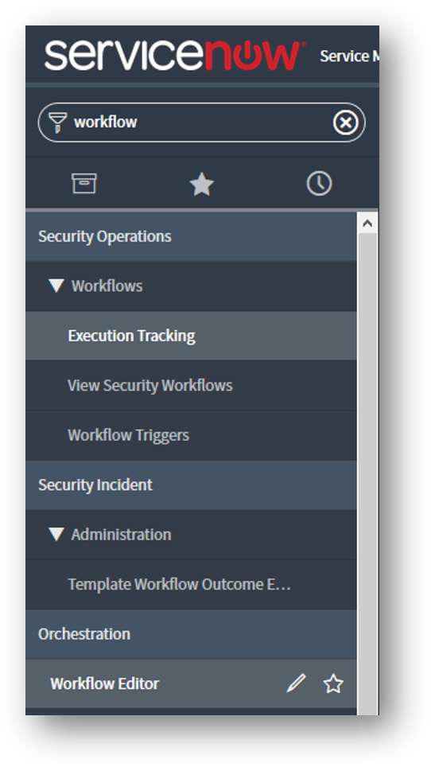
2. Click on Orchestration > Workflow Editor
3. Create a new workflow

4. In the upper right, click the `Custom` tab and add a `REST Web Service`
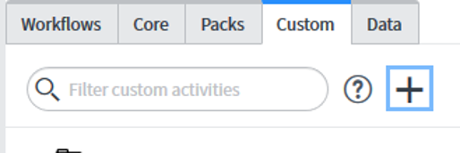
5. Configure the new Custom Activity

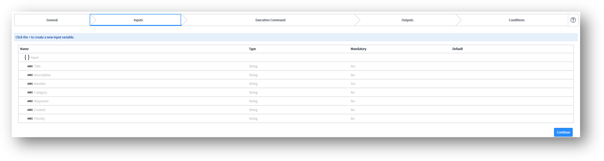
Drag inputs from the left to the associated variables on the right:
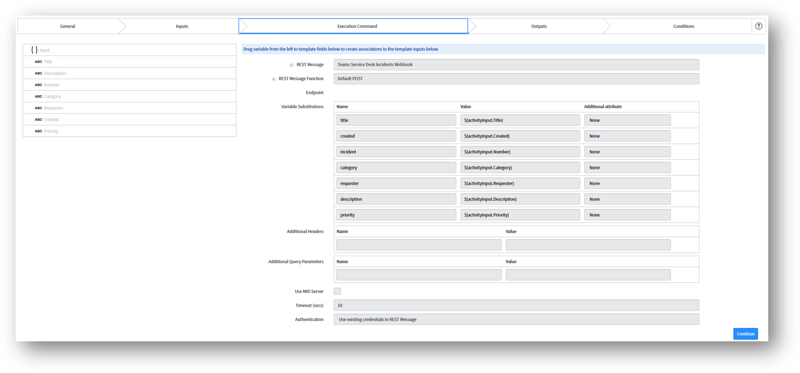
Add a Result parameter to the Output and drag it to the right:
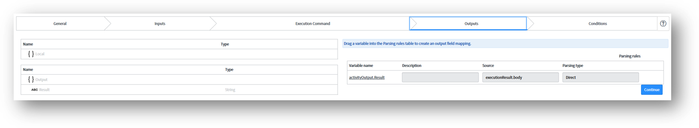
6. Save and Publish the Custom Activity
7. Add it to the Workflow

8.	Double click on the Teams Webhook for Incidents activity and enter the following values:

9. Move the arrows around until you get: Begin -> Teams Webhook for Incidents -> End
10.	Publish the workflow
11.	Test it by adding an Incident with Urgency = High, you should get a message posted to Teams that looks similar to this:
