# Teams Priority Incident Response
Enable more complex incident response scenarios by triggering a Microsoft Flow from ServiceNow (or your favorite ITSM solution) to create Teams channels, notify incident response members via teams, etc.

This example starts with a Priority Incident being created in ServiceNow, which will trigger a flow that calls a Microsoft Flow via REST, which adds a channel to an existing **Service Desk** team in Microsoft Teams and notifies relevant parties via Teams message.

In the future, I plan to include more complex capabilities, including calling the Microsoft Graph API to create/clone Teams, add tabs, trigger Bot to call triage members, etc. At that point, I'll also include a copy of the flow to import.

## BASIC

### Create an incoming webhook in Microsoft Teams
1. In Microsoft Teams, add an Incoming Webhook connector to the appropriate channel in the appropriate team.
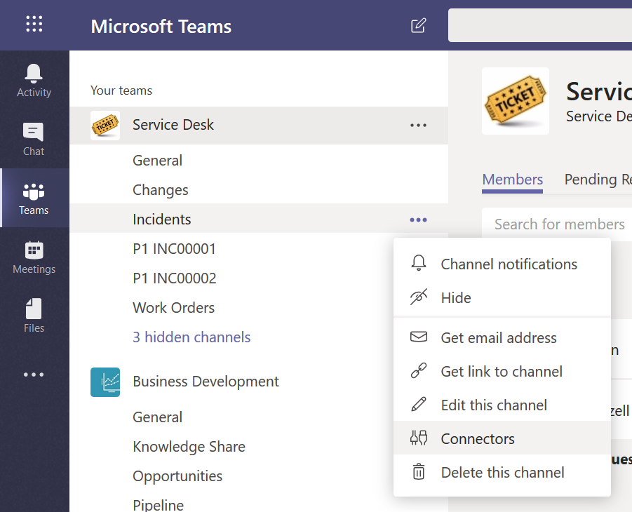
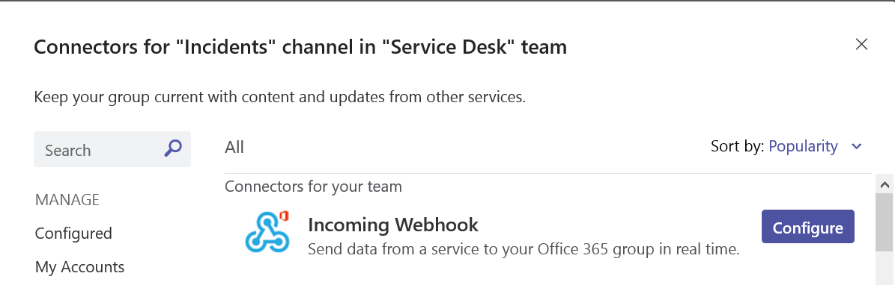
2. Copy the URL for the webhook and paste in OneNote/notepad

### Create ServiceNow flow to send notification to Microsoft Teams
1. Enable the ServiceNow IntegrationHub Installer plugin in ServiceNow (if not already enabled)
2. Open **Flow Designer** from the left nav in ServiceNow
3. Create a new flow
4. Trigger on a new Incident, filter on Priority = Critical
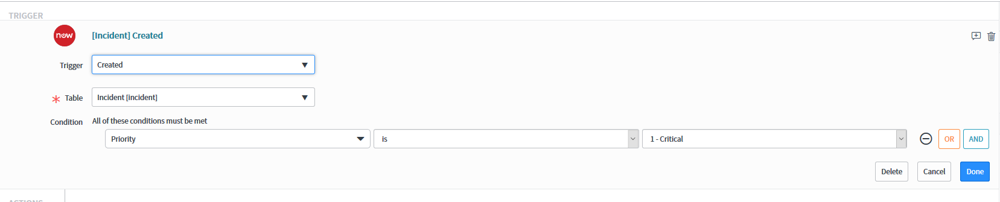
5. Add an action for **Microsoft Teams**: **Post Incident Details**, pasting in the incoming webhook we created earlier in Teams
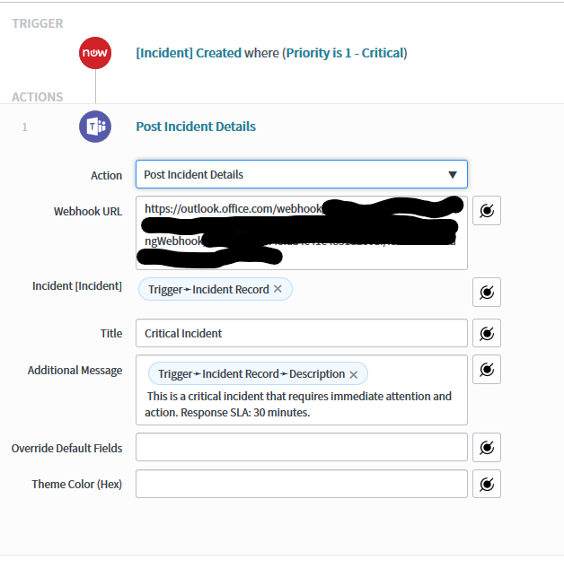
6. Activate the flow
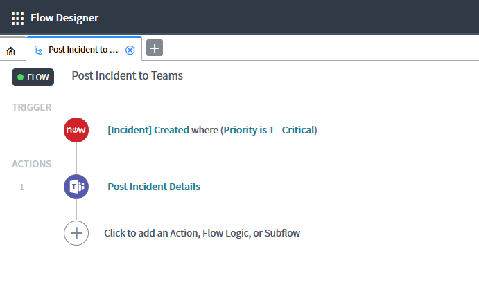
7. Test it by adding a new Incident in ServiceNow with the **Impact** and **Urgency** both set to **High**

## ADVANCED
### Create a new App Registration in Azure Active Directory
- See the [Teams Requests repo](https://github.com/cdbuzzell/TeamsRequests#register-an-application-in-azure-active-directory) for instructions on how to Register an Application in AAD

### Create a flow in Microsoft Flow
1. Browse to https://flow.microsoft.com
2. Click on **My flows**
3. Click **New -> Instant**, then click **Skip**
4. Add a **When a HTTP request is received** trigger
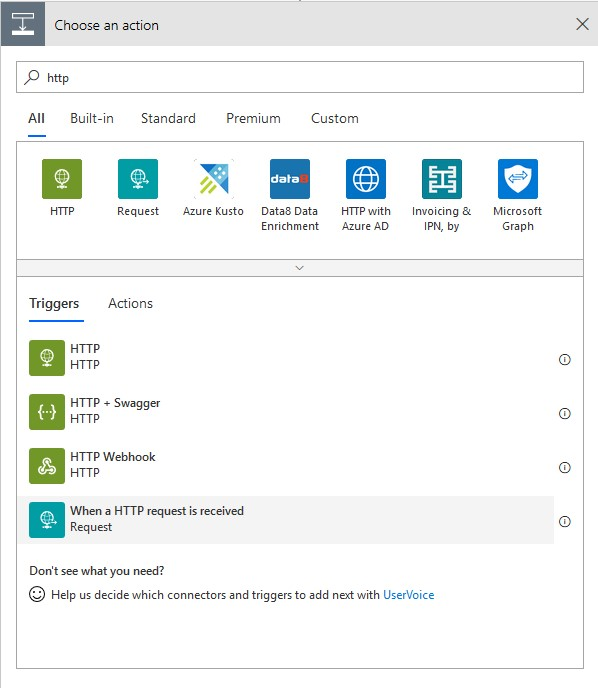
5. Use this sample payload (feel free to alter it to fit your needs) to generate the schema for this action (the URL will show up after you save this flow):
    ```json
    {
        "incident":"INC00001",
        "title":"Incident Title 1",
        "description":"Incident description 1",
        "url":"https://TENANT.service-now.com/nav_to.do?uri=incident.do?sysparm_query=number=INC00001",
        "triageMembers":"admin@TENANT.onmicrosoft.com,USER@TENANT.onmicrosoft.com"
    }
    ```
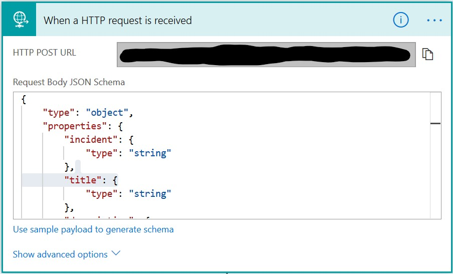
6. Add an action to **Create a channel** in **Microsoft Teams**, selecting the appropriate Team and display name (I used the incident property from the trigger)
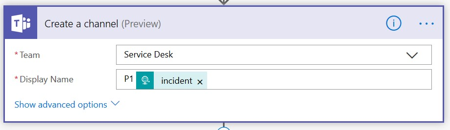
7. Add a **Compose** action to split the comma-delimited triageMembers email addresses into an array

    split(triggerBody()?['triageMembers'],',')
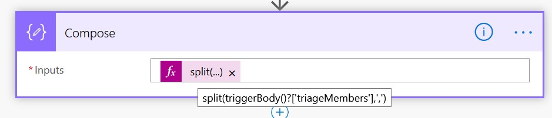
8. Add an action to **Post a message as the Flow bot to a user (Preview)** in **Microsoft Teams** (when you drop the Output of the Compose action into the Recipient field, the system will automatically add the **Apply to each** action)

9. Add an action for **Response**

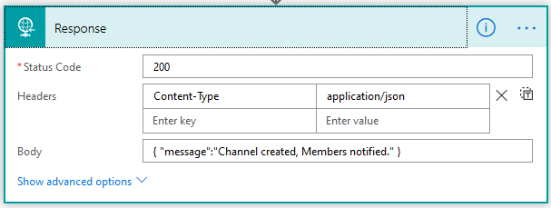

10. Alter this Flow to meet your needs, save it, then copy the HTTP POST URL from the trigger

**Note:** see the [TeamsRequests Flow](https://github.com/cdbuzzell/TeamsRequests/blob/master/TeamsCreationGovernance.zip) for an example of how to create a Team (instead of a channel) for every Incident

Your Flow should look something like this:

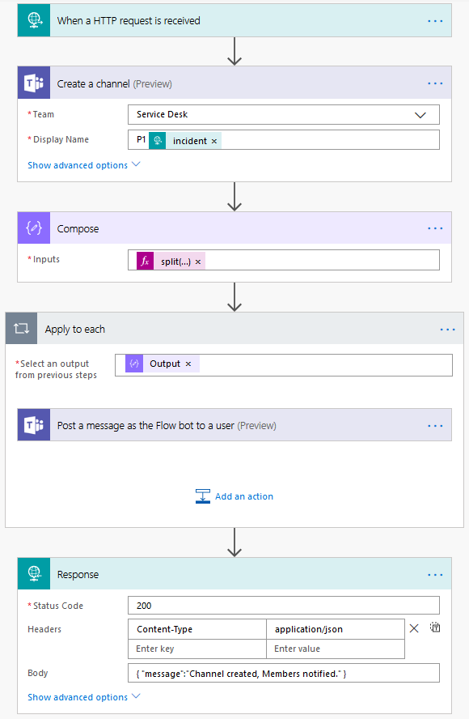

TODO: Test with PostMan

### Create ServiceNow Outbound REST Message to call Microsoft Flow
**Notice:** I am not an expert at anything, especially ServiceNow.
1. In ServiceNow, under System Web Services > Outbound, click on REST Message and create a new one.
2. Truncate your flow URL up to the *invoke* part of the path and enter that as the Endpoint (it won't let us just paste the whole URI, so enter everything before the ? mark, we'll add the rest of the URI [query string] later). Set Authentication to "No authentication"
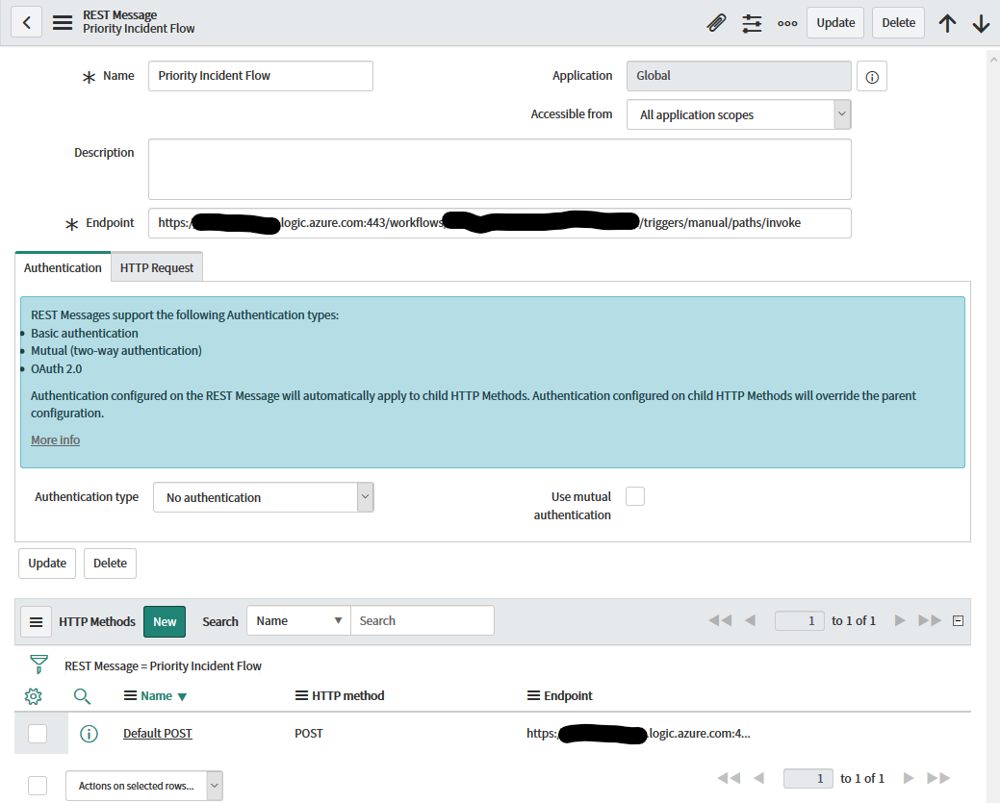
3. Add an HTTP Header for Content-Type
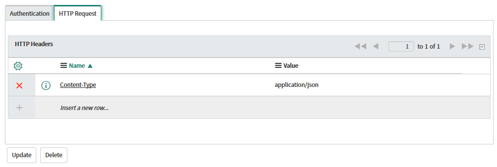
4. Add/use the Default POST HTTP Method
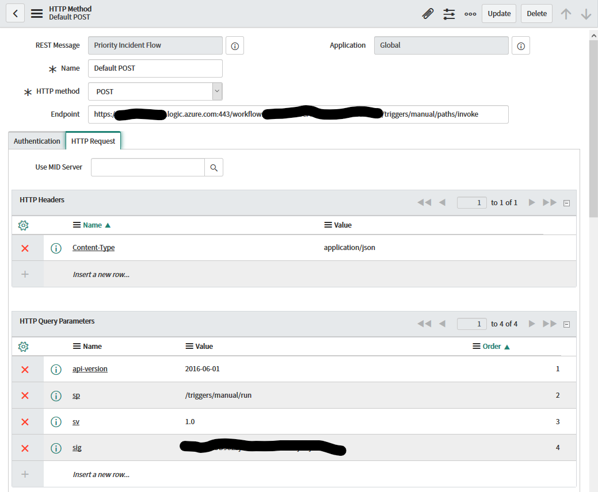
5. Copy/paste the json from #5 above into the *Content* field and replace values with variables (example: *${variableName}*)
6. Add the four Query Paramters that we stripped off the URL in #2. Pro tip: replace the *%2F* in the *sp* parameter with */* (*/triggers/manual/run*)
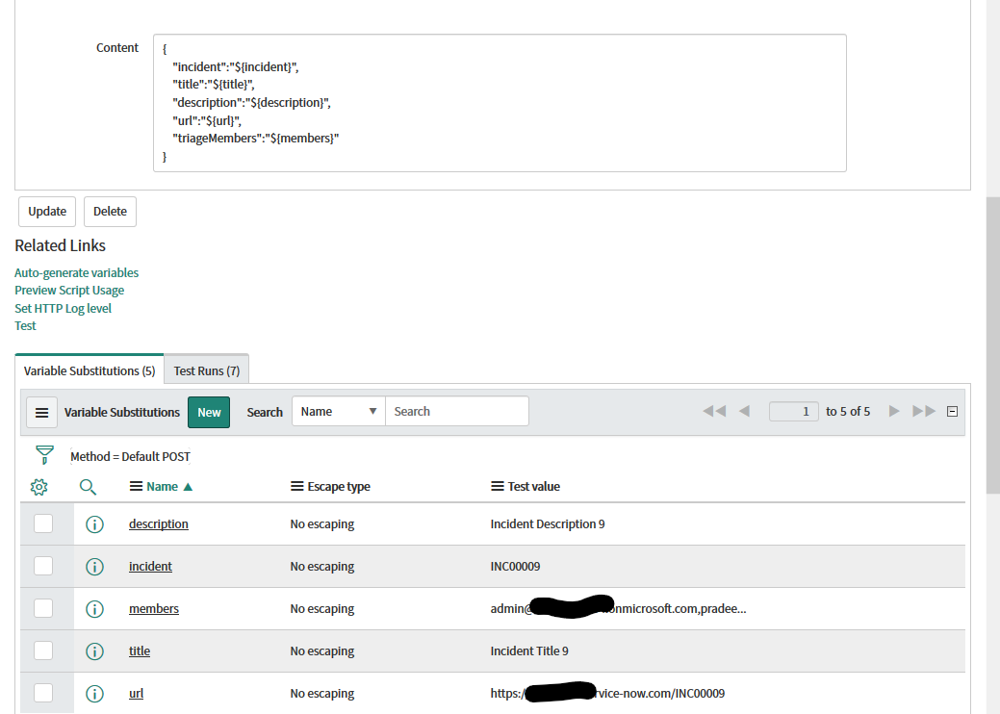
7. Add variable substitutions and Test

### Create ServiceNow workflow to call REST Message
1. Call the REST Message we created above in your existing Workflow or create a new Workflow.
2. TODO: document creating a new Workflow
