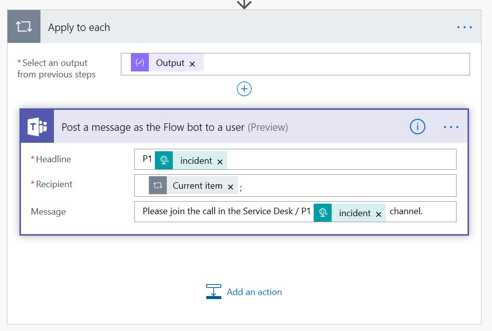

# Teams Priority Incident Response
Enable more connected and complex incident response scenarios by posting messages in Teams, creating new teams, notifying incident response members via teams, etc. from ServiceNow (or your favorite ITSM solution).

This example starts with a Priority Incident being created in ServiceNow, which will trigger a workflow that posts a message to Teams via REST, after which you can stand up a Teams meeting and invite participants to begin triage, record the meeting, chat, share screens, etc.

## Basic: post a message in a Teams channel from ServiceNow
1. [Create an incoming webhook in Microsoft Teams](#xreate-an-incoming-webhook-in-microsoft-teams)
2. [Create ServiceNow Outbound REST Message to call Microsoft Power Automate](#create-servicenow-outbound-rest-message-to-call-microsoft-power-automate)
3. [Create ServiceNow workflow to post message to Microsoft Teams](#create-servicenow-workflow-to-post-message-to-microsoft-teams)

## Advanced: call a PowerAutomate flow from ServiceNow that can notify people, create teams, etc.
1. Create a new App Registration in Azure Active Directory
2. Create a flow in Microsoft Power Automate
3. Create ServiceNow Outbound REST Message to call Microsoft Power Automate
4. Create ServiceNow workflow to call REST Message

## BASIC
### Create an incoming webhook in Microsoft Teams
1. In Microsoft Teams, create a team named `Service Desk` (if you don't already have a team you want to use)
2. Add a Channel named `Incidents`
3. Set up notifications on the `Incidents` channel to get notified on every message


4. Enable Channel moderation on `Incidents` so only priority incident notifications from Service Now are allowed as messages at the root level. This will make it harder for people to accidentally post new messages instead of relying to existing ones (except Owners could sitll do it). 


5. In Microsoft Teams, add an Incoming Webhook connector to the appropriate channel in the appropriate team.

6. Click `Configure` next to `Incoming Webhook`

7. Name: `ServiceNow Incidents`
8. Upload a ServiceNow logo image: https://community.servicenow.com/794bd5f3dbcbab40fa192183ca961966.iix
9. Click `Create`
10. Copy the `URL` for the webhook and paste in OneNote/notepad for later use

### Create ServiceNow Outbound REST Message to call Microsoft Power Automate
**Notice:** I am not an expert at anything, especially ServiceNow.
1. In ServiceNow, under `System Web Services` > `Outbound`, click on `REST Message`

2. Create a new one REST Message with the following properties:
    - Name: Teams Service Desk Incidents Webhook
    - Accessible from: All application scopes
    - Description: Call the Webhook configured in Microsoft Teams in the Incidents channel of the Service Desk team
    - Endpoint: [paste in the incoming webhook URL that was generated above in Basic step 1]
    - Add an HTTP Header for Content-Type: application/json

3. Add a Default POST HTTP Method


4. Set the Content field:
```
{
    "@type": "MessageCard",
    "@context": "http://schema.org/extensions",
    "themeColor": "0076D7",
    "summary": "${incident} - ${title}",
    "sections": [{
        "activityTitle": "${incident} - ${title}",
        "activitySubtitle": "${requester} created a Priority Incident in ServiceNow",
        "activityImage": "",
        "facts": [{
            "name": "Created",
            "value": "${created}"
        }, {
            "name": "Category",
            "value": "${category}"
        }, {
            "name": "Priority",
            "value": "${priority}"
        }, {
            "name": "Description",
            "value": "${description}"
        }],
        "markdown": true
    }],
    "potentialAction": [
        {
            "@context": "http://schema.org",
            "@type": "ViewAction",
            "name": "View in ServiceNow",
            "target": [
                "https://YOURINSTANCE.service-now.com/nav_to.do?uri=incident.do?sysparm_query=number=${incident}"
            ]
        },
        {
            "@context": "http://schema.org",
            "@type": "ViewAction",
            "name": "Start triage call",
            "target": [
                "https://bing.com"
            ]
        }
    ]
}
```

7. Add the following variable substitutions and Test


### Create ServiceNow workflow to call REST Message
1. In ServiceNow, search for “Workflow” in the Filter Navigator in the upper left

2. Click on Orchestration > Workflow Editor
3. Create a new workflow

4. In the upper right, click the `Custom` tab and add a `REST Web Service`

5. Configure the new Custom Activity


Drag inputs from the left to the associated variables on the right:

Add a Result parameter to the Output and drag it to the right:

6. Save and Publish the Custom Activity
7. Add it to the Workflow

8.	Double click on the Teams Webhook for Incidents activity and enter the following values:

9. Move the arrows around until you get: Begin -> Teams Webhook for Incidents -> End
10.	Publish the workflow
11.	Test it by adding an Incident with Urgency = High


## ADVANCED
### Create a new App Registration in Azure Active Directory
- See the [Teams Requests repo](https://github.com/cdbuzzell/TeamsRequests#register-an-application-in-azure-active-directory) for instructions on how to Register an Application in AAD

### Create a flow in Microsoft Power Automate
1. Browse to https://flow.microsoft.com
2. Click on **My flows**
3. Click **New -> Instant**, then click **Skip**
4. Add a **When a HTTP request is received** trigger

5. Use this sample payload (feel free to alter it to fit your needs) to generate the schema for this action (the URL will show up after you save this flow):
    ```json
    {
        "incident":"INC00001",
        "title":"Incident Title 1",
        "description":"Incident description 1",
        "url":"https://YOURINSTANCE.service-now.com/nav_to.do?uri=incident.do?sysparm_query=number=INC00001",
        "triageMembers":"admin@TENANT.onmicrosoft.com,USER@TENANT.onmicrosoft.com"
    }
    ```


6. Add actions to post a message in Teams or create a Team (see how to do that [here](https://github.com/cdbuzzell/TeamsRequests#create-power-automate-flow)) or whatever your business requirements dictate.

7. Add a **Compose** action to split the comma-delimited triageMembers email addresses into an array

    split(triggerBody()?['triageMembers'],',')

8. Add an action to **Post a message as the Flow bot to a user (Preview)** in **Microsoft Teams** (when you drop the Output of the Compose action into the Recipient field, the system will automatically add the **Apply to each** action)

9. Add an action for **Response**


10. Alter this Flow to meet your needs, save it, then copy the HTTP POST URL from the trigger

Your Flow should look something like this:


TODO: Test with PostMan

### Create ServiceNow Outbound REST Message to call Microsoft Power Automate
**Notice:** I am not an expert at anything, especially ServiceNow.
1. In ServiceNow, under System Web Services > Outbound, click on REST Message and create a new one.
2. Truncate your flow URL up to the *invoke* part of the path and enter that as the Endpoint (it won't let us just paste the whole URI, so enter everything before the ? mark, we'll add the rest of the URI [query string] later). Set Authentication to "No authentication"

3. Add an HTTP Header for Content-Type

4. Add/use the Default POST HTTP Method

5. Copy/paste the json from #5 above into the *Content* field and replace values with variables (example: *${variableName}*)
    ```json
    {
        "incident":"${incident}",
        "title":"${title}",
        "description":"${description}",
        "url":"${url}",
        "triageMembers":"${members}"
    }
    ```
6. Add the four Query Paramters that we stripped off the URL in #2. Pro tip: replace the *%2F* in the *sp* parameter with */* (*/triggers/manual/run*)

7. Add variable substitutions and Test

### Create ServiceNow workflow to call REST Message
1. Call the REST Message we created above in your existing Workflow or create a new Workflow (see Basic step 3 for how to do this)
