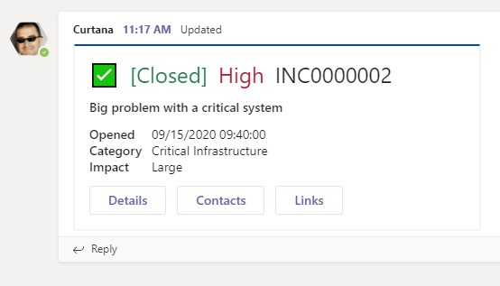

# Teams Priority Incident Response
[HOME](README.md) | [CRAWL](Crawl.md) | [WALK](Walk.md) | Run
## RUN: C# Bot

This project allows one to post an adaptive card to a channel in a team in Microsoft Teams via REST API POST. One can also update that card via REST API PUT. These card messages are posted/updated using a Bot.



## Prerequisites

### Register your bot and upload to Teams

1. [Register with the Bot Framework](https://docs.microsoft.com/en-us/microsoftteams/platform/bots/how-to/create-a-bot-for-teams#register-your-web-service-with-the-bot-framework)
	- We don't need to get callbacks from Teams at this point, so we don't need a web service for our Bot at this point. Just put whatever in the URL.
	- Copy the `Microsoft App ID` and `password` you get from this process, paste it into Notepad or something for later
3. [Create your app manifest and package](https://docs.microsoft.com/en-us/microsoftteams/platform/bots/how-to/create-a-bot-for-teams#create-your-app-manifest-and-package)
	- Make sure you enable the `Team` scope
4. [Upload your package to Microsoft Teams](https://docs.microsoft.com/en-us/microsoftteams/platform/bots/how-to/create-a-bot-for-teams#upload-your-package-to-microsoft-teams) to install your Bot in the Team where you want to post channel messages

*When you do this for reals, you may want to check this out if you have to send to many channels or users: [Enable proactive bot installation and proactive messaging in Teams with Microsoft Graph (Public Preview)](https://docs.microsoft.com/en-us/microsoftteams/platform/graph-api/proactive-bots-and-messages/graph-proactive-bots-and-messages?tabs=csharp)*


### Pick a Teams channel and get its ID
*Use the Teams web client to figure out the channel id*
1. Browse to https://teams.microsoft.com
2. Navigate to the channel you want to post messages to (under the Team you installed your Bot to above)
3. Copy the `threadid` from the URL in the address bar, paste this in Notepad or something for later


## How to test

### Configure the API project
1. Clone this repo to download the API project and create an appsettings.Development.json file (if there isn't one already) under appsettings.json
2. Copy settings from appsettings.json to appsettings.Development.json
```
	"MicrosoftAppId": "YOUR BOT ID",
	"MicrosoftAppPassword": "YOUR BOT SECRET",
	"ChannelId": "TEAMS CHANNEL ID (SHOULD START WITH SOMETHING LIKE 19:blahblahblah)",
	"ConversationsUrl": "https://smba.trafficmanager.net/amer/v3/conversations",
	"AdaptiveCardTemplatePath": "C:\\YOURPATH\\TeamsPriorityIncidentResponse\\PriotityIncident\\PriorityIncident.API\\PriorityIncidentCard.template.json"
```
3. Populate `MicrosoftAppId`, `MicrosoftAppPassword`, and `ChannelId` using the values you copied from Prerequisites
4. Update `AdaptiveCardTemplatePath` to use the path to the adaptive card template file  in your project on your machine

### Test your API with Postman

1. Run your API project (in Debug mode in IIS Express)
2. Open [Postman](https://www.postman.com/downloads/)
3. Import [this collection](Teams%20Priority%20Incident%20Response.postman_collection.json) into Postman
4. Open the `Notify of new Priority Incident` request and `Send` it
   - Note: This request saves the value of `id` from the response to a collection variable to be used by the next request
5. Check your channel in Teams to see the message
6. Open the `Update an existing notification` request and `Send` it
7. Check your channel in Teams to see the updated message