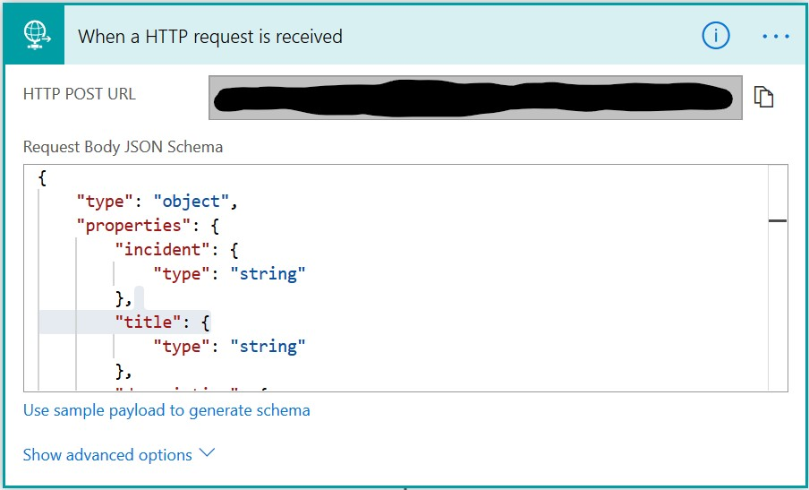
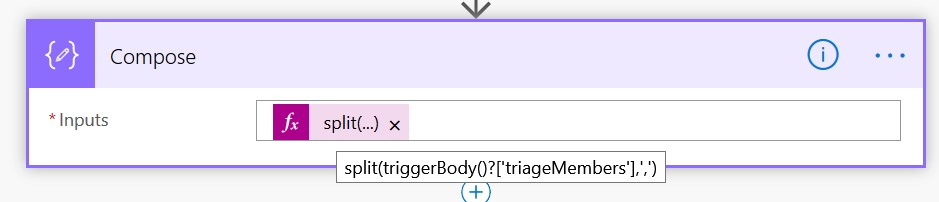
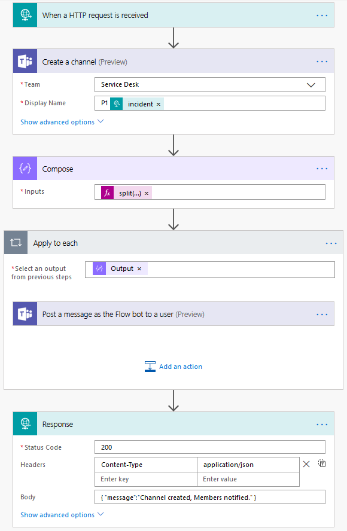
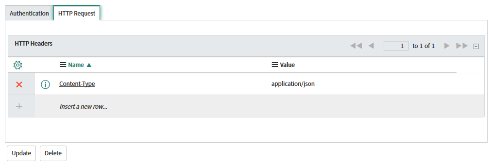
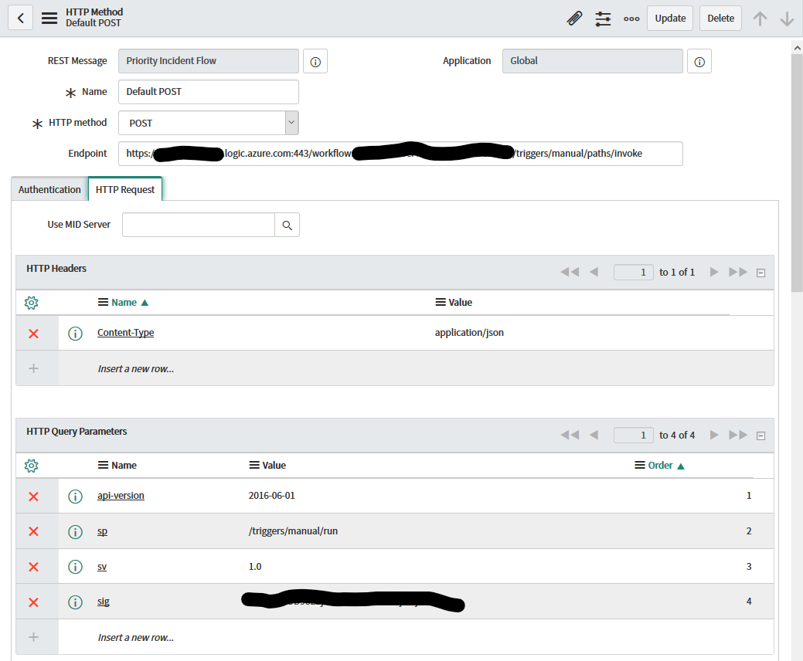

# Teams Priority Incident Response
[HOME](README.md) | [CRAWL](Crawl.md) | Walk | [RUN](Run.md)
## WALK: call a PowerAutomate flow from ServiceNow that can notify people, create teams, etc.
1. [Create a new App Registration in Azure Active Directory](#create-a-new-app-registration-in-azure-active-directory)
2. [Create a flow in Microsoft Power Automate](#create-a-flow-in-microsoft-power-automate)
3. [Create ServiceNow Outbound REST Message to call Microsoft Power Automate](#create-servicenow-outbound-rest-message-to-call-microsoft-power-automate-1)
4. [Create ServiceNow workflow to call REST Message](#create-servicenow-workflow-to-call-rest-message-1)

### Create a flow in Microsoft Power Automate
1. Browse to https://flow.microsoft.com
2. Click on `My flows`
3. Click `New -> Instant`, then click `Skip`
4. Add a `When a HTTP request is received` trigger

5. Use this sample payload (feel free to alter it to fit your needs) to generate the schema for this action (the URL will show up after you save this flow):
    ```json
    {
        "incident":"INC00001",
        "title":"Incident Title 1",
        "description":"Incident description 1",
        "url":"https://YOURINSTANCE.service-now.com/nav_to.do?uri=incident.do?sysparm_query=number=INC00001",
        "triageMembers":"admin@TENANT.onmicrosoft.com,USER@TENANT.onmicrosoft.com"
    }
    ```


6. Add actions to post a message in Teams or create a Team (see how to do that [here](https://github.com/cdbuzzell/TeamsRequests#create-power-automate-flow)) or whatever your business requirements dictate.

7. Add a `Compose` action to split the comma-delimited triageMembers email addresses into an array

    split(triggerBody()?['triageMembers'],',')

8. Add an action to `Post a message as the Flow bot to a user (Preview)` in `Microsoft Teams` (when you drop the Output of the Compose action into the Recipient field, the system will automatically add the `Apply to each` action)

9. Add an action for `Response`


10. Alter this Flow to meet your needs, save it, then copy the `HTTP POST URL` from the trigger

Your Flow should look something like this:



TODO: Test with PostMan

### Create ServiceNow Outbound REST Message to call Microsoft Power Automate
**Notice:** I am not an expert at anything, especially ServiceNow.
1. In ServiceNow, under `System Web Services` > `Outbound`, click on `REST Message` and create a new one.
2. Truncate your flow URL up to the *invoke* part of the path and enter that as the Endpoint (it won't let us just paste the whole URI, so enter everything before the ? mark, we'll add the rest of the URI [query string] later). Set Authentication to "No authentication"

3. Add an `HTTP Header` for `Content-Type`

4. Add/use the `Default POST` HTTP Method

5. Copy/paste the json from #5 above into the `Content` field and replace values with variables (example: *${variableName}*)
    ```json
    {
        "incident":"${incident}",
        "title":"${title}",
        "description":"${description}",
        "url":"${url}",
        "triageMembers":"${members}"
    }
    ```
6. Add the four Query Parameters that we stripped off the URL in #2. Pro tip: replace the *%2F* in the *sp* parameter with */* (*/triggers/manual/run*)

7. Add variable substitutions and Test

### Create ServiceNow workflow to call REST Message
1. Call the REST Message we created above in your existing Workflow or create a new Workflow (see Basic step 3 for how to do this)
